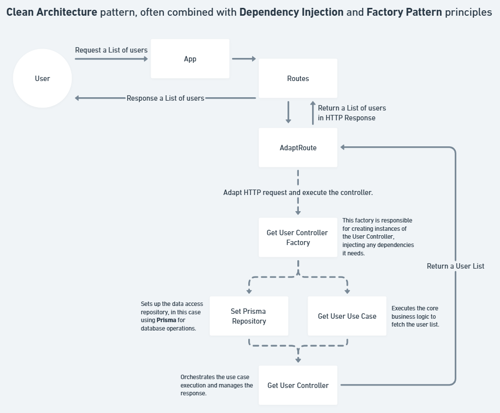

# I Want to Ask Project
## Arquitetura
Clean Architecture:

## Estrutura do Projeto
```plaintext
├── src
│   ├── config
│      └── auth.ts
│   ├── core
│      ├── controllers
│      ├── entities
│      └── middleware.ts
│   ├── infra
│      ├── http
│         ├── adapters
│         ├── factories
│         ├── responses
│         ├── routes
│         ├── app.ts
│         └── server.ts
│      └── prisma
│         └── client.ts
│   ├── modules
│      └── users
│   └── test
├── prisma
│   ├── migrations
│   └── schema.prisma
├── README.md
└── package.json
```

## Instalação
#### Pré-requisitos
- Node.js >= 22.x
- Npm

#### Passos de Instalação
1. Clone o repositório:
```bash
git clone git@github.com:guilhermesalviano/Iwanttoask-api.git
```
2. Entre na pasta do projeto:
```bash
cd Iwanttoask-api
```
3. Instale as dependências:
```bash
npm install
```
4. Configure as variáveis de ambiente:

Crie um arquivo .env baseado no .env.example e adicione suas configurações (banco de dados, credenciais de API, etc.).
5. Execute o projeto:
```bash
npm run dev
```
6. Acesse o projeto em http://localhost:3333

## Usando o Prisma:
1. Instale o prisma e inicie.
```bash
npm install @prisma -D
npx prisma init
```
2. Configure seu schema com o arquivo que foi iniciado.
2.1 Configure seu .env com a URL de conexão.

3. Crie migration files
```bash
npx prisma migrate dev --name migrations
```
4. Ative as migrations. 
```bash
npx prisma generate
```
Fim.